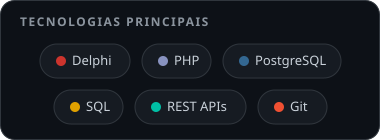

<h1 align="center">Olá, eu sou o Panda 👋</h1>

  

  
  

## 🐼 Sobre mim

- 🙋 **Victor Hugo Gonzales**
- 💻 Desenvolvedor de software com mais de **20 anos** de experiência
- 🧾 Especialista em **ERP**, **Boletos Bancários** e **Documentos Fiscais Eletrônicos** (NF-e, NFS-e NFC-e, CT-e, etc.)
- 🔌 Construção e integração de **APIs**
- 🇧🇷 Envolvido com o ecossistema de documentos fiscais do Brasil.
- 📍 Maringá – PR, Brasil

## 🛠️ Tecnologias

  

## 🌱 Estudando

  
  
  

## 📊 Streak do GitHub

  

## 📫 Contato

  
    
    

  <picture>
    <source media="(prefers-color-scheme: dark)" srcset="https://raw.githubusercontent.com/victorgonzales/victorgonzales/output/github-contribution-grid-snake-dark.svg" />
    <source media="(prefers-color-scheme: light)" srcset="https://raw.githubusercontent.com/victorgonzales/victorgonzales/output/github-contribution-grid-snake.svg" />
    
  </picture>

